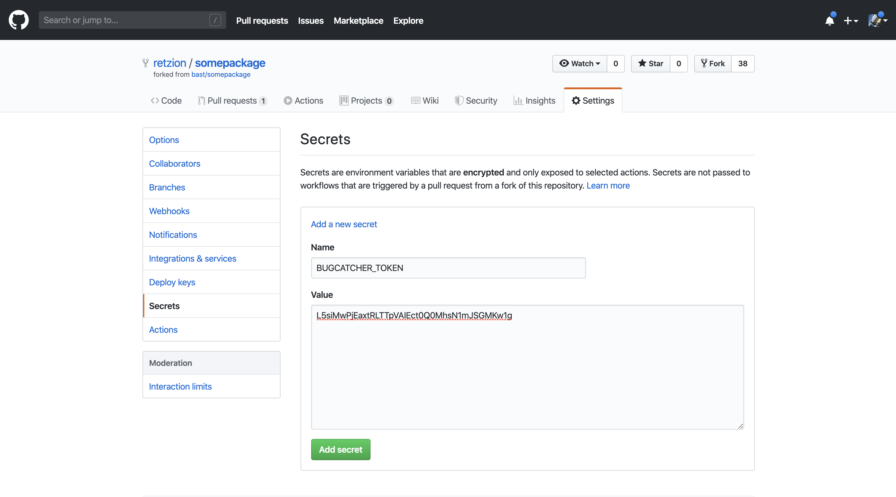

# BugCatcher Demo

## Setup

You will find your <code>BUGCATCHER_TOKEN</code> in the dashboard of your [BugCatcher](https://bugcatcher.fasterthanlight.dev) account. Click the GitHub Action button.

## Saving Your Token as a GitHub Secret

Go to the Settings tab of your repository on GitHub. You will see a `Secrets` section on the left. You can securely store your <code>BUGCATCHER_TOKEN</code> here. &nbsp; *([more info](https://help.github.com/en/actions/automating-your-workflow-with-github-actions/virtual-environments-for-github-hosted-runners#creating-and-using-secrets-encrypted-variables))*

## Adding the GitHub Action YML File

GitHub Actions are triggered when a `.yml` or `.yaml` file is found in the `.github/workflows` directory of your repository. You can create such a file as something like `.github/workflows/bugcatcher.yml` in your repository and GitHub will run the Action each time code is pushed. *(In our example we use `push` as the event, but you can customize the workflow yourself by using the [workflow syntax](https://help.github.com/en/actions/automating-your-workflow-with-github-actions/workflow-syntax-for-github-actions) from GitHub.)*

## GitHub Workflows and Action Output

Now that GitHub is configured to run the BugCatcher Action on any `push` event, we can watch it in "action" by viewing the "Actions" tab on the repository webpage or in your pull request conversation view. 

### PR Conversation View

*INIT*

*IN PROGRESS*

*COMPLETE*

### Actions Tab

*WORKFLOWS*

*ACTION LOGS*

## Test Results

&nbsp;

&nbsp;

## Videos

### deprecated video 1
This has old status contexts and labels. We will add and updated video soon.

